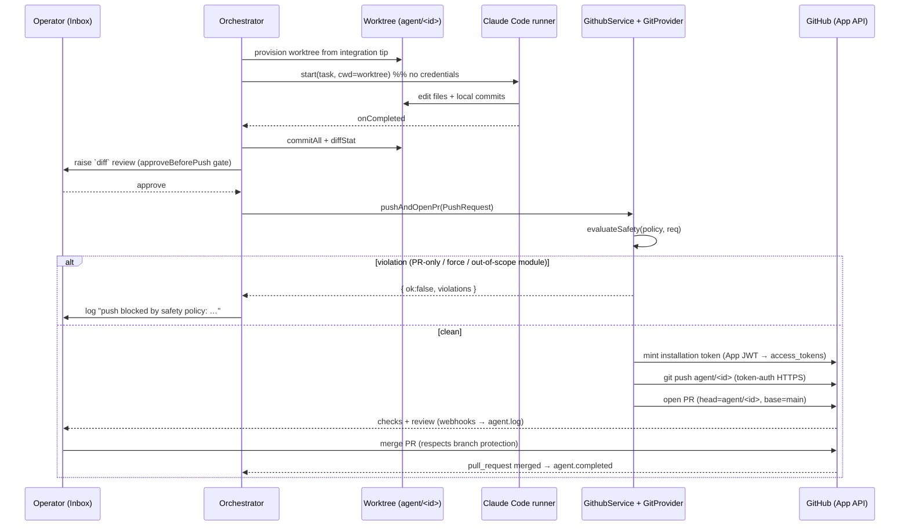

# GitHub Integration — Contract & Architecture

> Status: **implemented (server) + design (webhooks/persistence)**. The FE surface
> (connect flow + safety panel + Integrations view) ships in the prototype
> (`github.jsx`). The server pieces — GitProvider (App token + push + PR + merge),
> the safety preflight, the connection store, REST routes, and the orchestrator
> wiring — live in `skynet/apps/server/src/github/` and are exercised by
> `skynet/tests/github-safety.test.ts`. Still design-only: durable connection
> persistence (Postgres adapter) and inbound webhook handling (§6).
> Companion: `docs/vcs-and-conflict-model.md` (branch-per-agent + merge engine).

## 1. Principles

1. **GitHub App, not OAuth/PAT.** Skynet authenticates as a GitHub App installation,
   not as a user and not via a long-lived personal token. This gives per-repo,
   fine-grained, least-privilege permissions, short-lived auto-refreshed tokens,
   org-level install/revoke, and a webhook channel.
2. **PR-first.** Agents never mutate the default branch directly. Work flows
   `branch (agent/<id>) → commits → PR → checks → review → merge`. Aligns with the
   one-branch-per-agent model and the merge engine.
3. **Least privilege.** Request only the permissions below; scope to selected repos.
4. **Safety is server-enforced.** Every guardrail (§5) is checked server-side in a
   pre-write hook. The client toggles reflect policy; they never *are* the
   enforcement. A bypassed client cannot defeat a guardrail.
5. **No secrets at rest.** Store the App private key in a secret manager; never
   persist installation tokens — mint on demand, cache in memory until expiry.
6. **One repo per project.** A Skynet project binds to exactly one repository
   (`Project.repo`); all of that project's agents branch and PR within it. An
   installation may grant many repos, but each project pins a single one — this
   keeps branch-per-agent and the merge engine scoped to one repo at a time.

## 2. GitHub App

### Permissions (fine-grained)

| Permission       | Level        | Why                                        |
| ---------------- | ------------ | ------------------------------------------ |
| Contents         | Read & write | branch, commit, push agent work            |
| Pull requests    | Read & write | open / update PRs for review               |
| Checks           | Read         | surface CI status on the agent             |
| Metadata         | Read         | mandatory baseline                         |

> Deliberately **not** requested: Actions write, Administration, Secrets, Members.
> Merging respects branch protection; Skynet does not need admin to do its job.

### Webhook events

`installation`, `installation_repositories`, `push`, `pull_request`,
`pull_request_review`, `check_suite`, `check_run`.

### Install flow

1. Operator clicks **Install Skynet GitHub App** → redirect to
   `https://github.com/apps/<app-slug>/installations/new` (optionally pre-scoped via
   the App "request" URL with `state` = `workspaceId` for CSRF + mapping).
2. GitHub redirects back with `installation_id`; we also receive an `installation`
   webhook. Persist the `installation_id ↔ workspaceId` mapping.
3. Operator selects repositories (all or a subset). We mirror the selection from the
   `installation_repositories` webhook / `GET /installation/repositories`.

### Token exchange (server-only)

```
App JWT     = sign({iss: APP_ID, iat, exp:+10m}, APP_PRIVATE_KEY, RS256)
InstToken   = POST /app/installations/{installation_id}/access_tokens   (Bearer JWT)
            → { token, expires_at (~1h), permissions, repository_selection }
```

Cache `InstToken` in memory keyed by `installation_id`; refresh when `expires_at`
is within a 5-minute skew. Never log or persist it.

## 3. Connection model (contract types)

Pre-land in `packages/shared` (Core owns the spine). Shapes the FE already speaks:

```ts
export interface GithubInstallation {
  id: number;                 // GitHub installation id
  account: string;            // org or user login
  type: 'Organization' | 'User';
  appSlug: string;
}
export interface GithubRepo {
  id: number;
  name: string;               // "owner/repo"
  defaultBranch: string;
  private: boolean;
  selected: boolean;          // included in this installation's selection
}
export interface SafetyPolicy {
  prOnly: boolean;            // no direct pushes to the default branch
  noForcePush: boolean;       // block force-push / history rewrite
  moduleAllowlist: boolean;   // agent may only touch its assigned modules
  approveBeforePush: boolean; // HITL gate before push/merge
}
export interface GithubConnection {
  workspaceId: string;
  connected: boolean;
  installation: GithubInstallation | null;
  repos: GithubRepo[];
  safety: SafetyPolicy;       // defaults: all true
}
```

`SAFETY_DEFAULTS` = every flag `true`.

## 4. Agent git operations (the `GitProvider` seam)

Agents never shell out to `git` against GitHub directly; they call a provider that
holds the installation token and enforces §5. One implementation per host
(`GitHubProvider` first).

```ts
export interface GitProvider {
  ensureBranch(repo: string, branch: string, fromRef: string): Promise<void>;
  commitFiles(repo: string, branch: string, files: FileChange[], msg: string): Promise<{ sha: string }>;
  push(req: PushRequest): Promise<PushResult>;        // runs the safety preflight
  openPr(repo: string, head: string, base: string, title: string, body: string): Promise<{ number: number; url: string }>;
  prStatus(repo: string, number: number): Promise<PrStatus>;
  merge(repo: string, number: number, method: 'merge'|'squash'|'rebase'): Promise<MergeResult>;
  syncBase(repo: string, branch: string, base: string): Promise<void>;  // pull/rebase base into agent branch
}
```

`PushRequest` carries `{ workspaceId, agentId, repo, branch, files }` so the
preflight has everything it needs to evaluate policy.

## 4a. Agent integration flow (how an agent actually uses GitHub)

**The principle: agents work locally; Skynet brokers the remote.** A runner (e.g.
the Claude Code agent) executes in an isolated git **worktree** Skynet provisions
for it. There it edits files and makes *local* commits on `agent/<id>`. It has
**no GitHub credentials** and no copy of the App key — so it physically cannot
push, and the safety guardrails (§5) can't be bypassed. Every remote operation
(push / PR / merge) runs in Skynet's server code (`github/service.ts` →
`GitProvider`), authenticated with a short-lived installation token.

Lifecycle of one agent:

```
1. Provision   Orchestrator cuts a worktree on agent/<id> from the integration
               tip (worktrees.ts). Runner starts in that cwd — no remote creds.
2. Work        Claude Code edits + commits locally. It cannot reach github.com.
3. Complete    Orchestrator commits any uncommitted diff, computes the diff stat,
               and raises a `diff` HITL review (the approveBeforePush gate).
4. Approve     Operator approves in the Inbox → orchestrator.deliver().
5. Preflight   githubService.pushAndOpenPr() loads the workspace policy and runs
               evaluateSafety() — PR-only / no-force / module-allowlist. Any
               violation ⇒ blocked, nothing is pushed, the reason is logged.
6. Push + PR   If clean: mint installation token → git push agent/<id> → open PR
               against the default branch (GitHubProvider).
7. Checks      CI runs on GitHub; check/PR webhooks stream back as agent.log (§6).
8. Merge       Merge via the Pulls API, respecting branch protection + reviews.
               PR-merged webhook → agent.completed.
```

Sequence (the broker sits between the agent and GitHub):



**Why not hand the agent a token?** Claude Code *can* run `git push` itself — if it
held a credential the guardrails would be advisory, not enforced. Two models keep
the broker in control: the **broker model** above (default — Skynet performs the
push/PR), or a **credential-helper model** where Skynet injects a just-in-time,
branch-scoped token into the agent's git and leans on GitHub branch protection +
a pre-receive check. The default is the broker.

## 5. Safety policy — enforcement

Evaluated in `push()` / `merge()` **before** any GitHub write. Returns a typed
rejection (surfaced to the agent log + Inbox), never a silent drop.

| Flag                 | Enforcement |
| -------------------- | ----------- |
| `prOnly`             | Reject any `push`/`merge` whose target is the repo default branch. Direct writes only allowed to `agent/*` branches. Also assert GitHub branch protection on the default branch is on (warn if not). |
| `noForcePush`        | Reject non-fast-forward updates / `force` flag on agent branches. |
| `moduleAllowlist`    | Resolve each changed path through `.skynet/modules.json` (see vcs-and-conflict-model §3) → module ids; reject if any path falls outside the agent's assigned modules. |
| `approveBeforePush`  | Instead of pushing, raise a HITL item (`kind: 'approval'`, the diff as payload) and park the op. On approve → execute the held push/merge (idempotent, first-writer-wins per the HITL model); on reject → discard. |

Policy is read per-workspace. Toggling a flag takes effect on the next op; it never
retroactively rewrites history.

## 6. Webhooks → event stream

Map GitHub webhooks onto the existing event bus so the UI updates live:

| GitHub webhook                      | Skynet event                          |
| ----------------------------------- | ------------------------------------ |
| `push` (agent branch)               | `agent.progress` / `agent.log`       |
| `pull_request` opened/synchronized  | `agent.log` (+ link PR to agent)     |
| `check_run` / `check_suite`         | `agent.log` (CI status), gate review |
| `pull_request` closed & merged      | `agent.completed`                    |
| `pull_request_review` changes_req   | `hitl.raised` (revision needed)      |
| `installation` deleted              | mark connection disconnected         |

Verify every webhook with the App webhook secret (HMAC-SHA256 over the raw body).

## 7. REST surface (server)

```
GET    /api/github                      → GithubConnection (workspace-scoped)
GET    /api/github/install-url          → { url } (App install redirect w/ state)
GET    /api/github/callback             ← GitHub redirect (installation_id, state)
GET    /api/github/repos                → GithubRepo[] (from the installation)
PUT    /api/github/repos                ← { repoIds: number[] } update selection
PUT    /api/github/safety               ← SafetyPolicy (partial) → updated policy
DELETE /api/github                      → revoke / forget installation
POST   /api/github/webhook              ← GitHub webhooks (HMAC-verified)
```

All workspace-scoped via the existing `resolvePrincipal`/token auth. The connection
+ policy persist via the `Store` (new `getGithubConnection` / `putGithubConnection`).

## 8. Failure modes

- **Token expiry mid-op** → transparent refresh + single retry.
- **Permission revoked / app uninstalled** → next op fails closed; surface a
  "reconnect GitHub" banner; never fall back to a user PAT.
- **Branch protection blocks merge** → respected, not bypassed; merge waits for
  required reviews/checks. Surface the reason in the Inbox.
- **Rate limits** → installation tokens are per-installation; back off on
  `x-ratelimit-remaining`, queue writes.

## 9. Lane handoffs

Done (this change):

- **Core** — §3 contract types live in `packages/shared` (`SafetyPolicy`,
  `GithubConnection`, …); `Project.repo` binds one repo per project.
- **GitProvider + preflight** — `github/{provider,safety,service}.ts`: App-JWT
  token mint, push (git-over-HTTPS), PR/merge (REST), and `evaluateSafety()`.
- **Module allowlist** — reuses `modules-map.ts` (glob → module id) to classify an
  agent's changed files before push.
- **Orchestrator wiring** — `deliver()` routes an approved diff through
  `githubService.pushAndOpenPr()` when the workspace is connected and the project
  is bound to a repo; otherwise the local merge engine handles it (default path
  unchanged). Runners still never touch git — the orchestrator brokers it.
- **REST** — `GET/PUT/DELETE /api/github` + `PUT /api/github/safety` (workspace-scoped).

Still pending:

- **Lane A (Auth)** — durable connection persistence (Postgres adapter behind
  `GithubConnectionStore`; memory-only today) + inbound webhook signature
  verification alongside `auth.ts`.
- **Webhooks (§6)** — the push/PR/check → event-stream mapping (PR-merged →
  `agent.completed`) is specified but not yet wired.
- **Install/callback** — the App install redirect + OAuth-style callback that
  records the installation id (the FE connect flow currently posts it directly).
